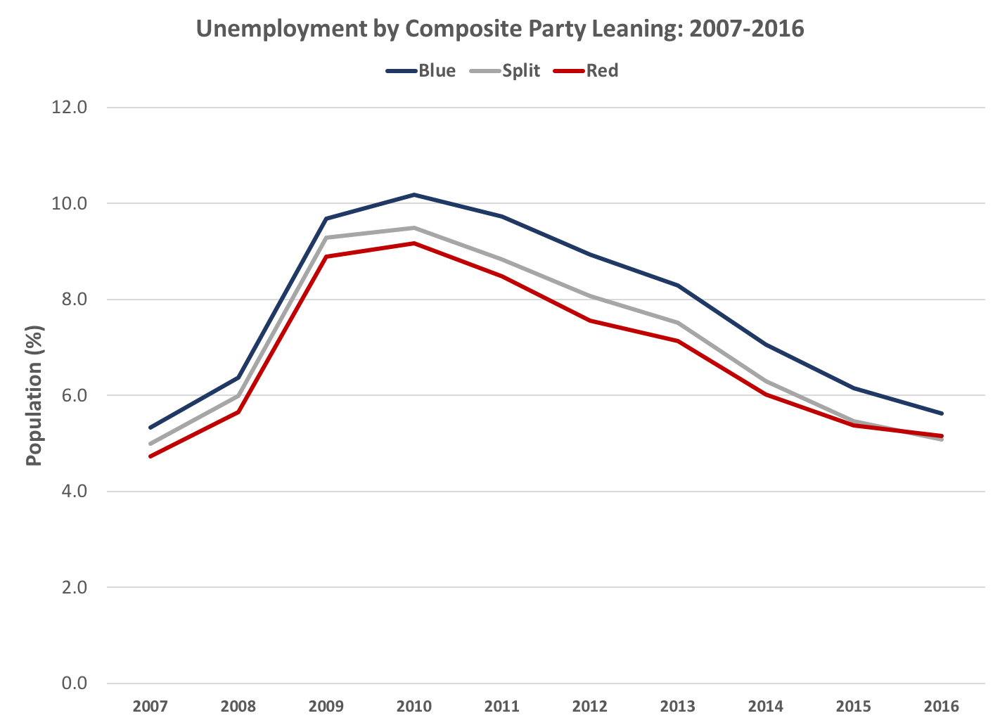

# US Voting Trends by Major Societal Domains
### Analysis presented by Jeff Frimpter, Victoria Lam, Jose Diaz, and Jing Chi

Using the US Census API and public US Census county-level data files, we selected five variables (education, race/ethnicity, poverty, unemployment, and lack of health insurance) and compared the trend of these variables in all US counties to the major political party voting trends for the 2008, 2012, and 2016 general election cycles. A Red or Blue county was determined if ≥52% of the votes were for the Republican Party or Democratic Party, respectively. A Split county was determined if the breakdown of party voting was between 48-52%. 

## Objectives and questions:
### 1) Are there observable political party voting trends based on major domains of society in the United States, such as 
### *- Level of education?*

After breaking down the composite data (2008-2016) by education levels, we observed that a higher percentage of the population that held higher degrees - Bachelor's and Graduate - voted for the Democratic party than for the Republican party. A reverse trend was observed in the population that held high school degrees. In addition, more individuals that held high school degrees voted in the elections than those who did not complete high school or pursued further education. 

### *- Demographics?*

Overall, in counties that voted Red, Blue, or were Split, a majority of voters for each election were ethnically White. In the African-American, Asian, and Hispanic/Latino populations, there was a positive trend from 2008 to 2016 in Democratic Party votes, while Republican Party votes remained consistent. In the White population, there was a negative trend in Democratic Party votes and split votes, while Republican Party votes remained consistent.   

### *- Poverty?*

The bar graph on the LEFT shows how the poverty change from 2000 to 2009 was +3.7% among counties voting Blue 2008-2012, and approximately +2.8% among those voting Red in the same elections. Overall, poverty increased more among Blue counties than among Red counties (no statistical testing applied).

The bar graph on the RIGHT shows how the proportion of people in poverty decreased among Blue counties from 2008 to 2016. This may have been due to a true reduction in poverty levels among these Blue counties, or to a smaller share of counties voting Blue in 2012 and 2016.

### *- Unemployment?*

Unemployment is higher among the Blue counties. The slide shows that even though the Blue, Red, and Split have similar upward and downward trend, the counties that voted Blue had a higher percentage of unemployment then Red and Split. The Blue showed a 1-2% higher unemployment population than the other two between the years of 2007 to 2016. Based on the line graph, the unemployment percentage rate was highest in 2010 for all three parties. The lowest year of unemployment percentage rate for the three parties was 2007.

### *- Health insurance?*

Here we examined the proportion of the population <18 years old and 18-64 years old by counties leaning Blue, Red or Split (people >65 years old are excluded due to enrollment in Medicare which would not reflect US health insurance coverage). First we calculated the average proportion of the population from each county that did not have health insurance in 2005, 2006, and 2007, based on available data.

For both children <18 years old and adults 18-64, Blue and Split counties had lower and decreasing proportions of people with no health insurance, whereas Red counties had more and increasing proportions of the population without health insurance coverage.

### 2) How does state-level voting information and access vary by trends and societal domains?

We selected Florida as a specific case analysis because it is known as a "swing-state" in the elections and has one of the highest percentage of uninsured residents in the state. Of the 25% of uninsured individuals, a majority of this subsection (13%) resided in Blue counties.   
